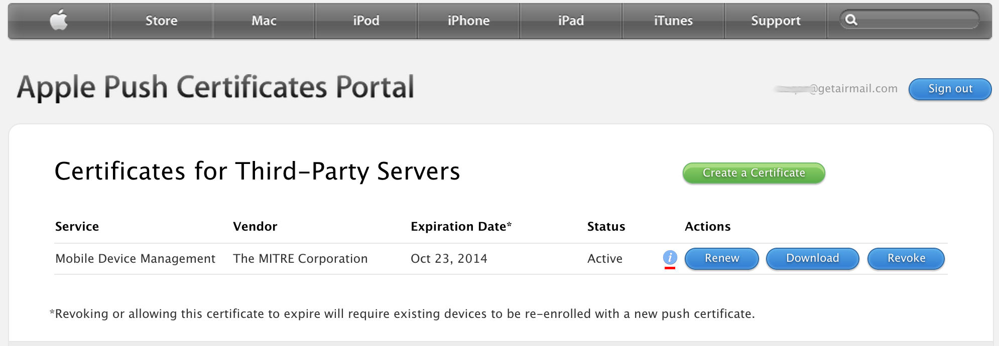
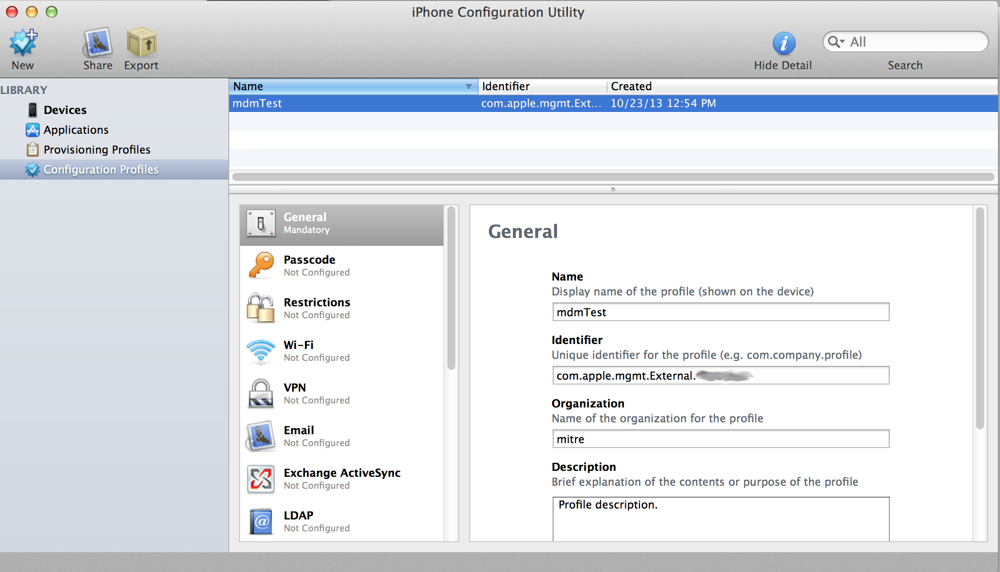
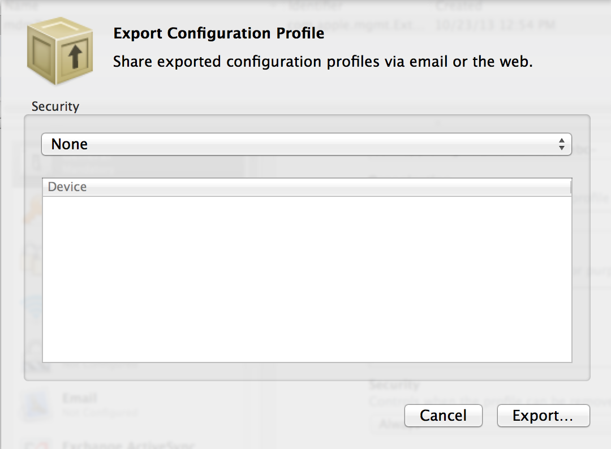
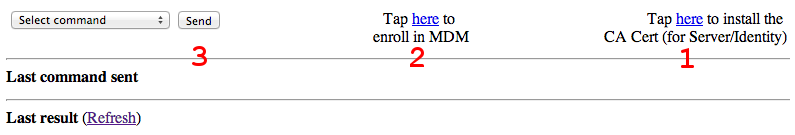
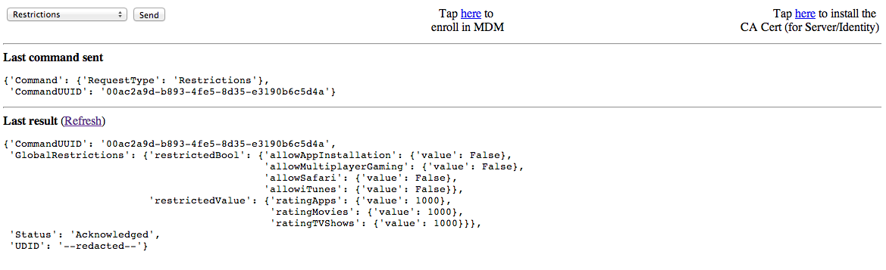

# Overview

Instructions and code for setting up a simple iOS Mobile Device Management (MDM) server.  MDM allows for OS level control of multiple devices from a centralized location.  A remote administrator can install/remove apps, install/revoke certificates, lock the device, change password requirements, etc.  

# Prerequisites

 * Publicly accessible Linux/Unix server
 * Apple Enterprise Account
 * Apple Developer Account
 * openssl command-line
 * Java SDK (java/javac)
 * Apple's iPhone Configuration Utility
    * (OS X Version)[http://support.apple.com/kb/dl1465]
    * (Windows Version)[http://support.apple.com/kb/DL1466]

# Certificate Setup

First run **make_certs.sh**.  Hopefully this works properly and generates 90% of what you need.

Download the [MDM vendor CSR signing tool](http://www.softhinker.com/in-the-news/iosmdmvendorcsrsigning/Softhinker.zip) from [Softhinker](http://www.softhinker.com/).  You will notice several certificates are included:
 * customer.der
   * Must be replaced
   * Generated from **make_certs.sh**
   * Accept defaults for all other values (Including **Challenge password**)
 * intermediate.pem 
   * Does not need replaced
   * Apple's WWDR intermediate certificate
 * mdm.pem
   * Must be replaced
   * Obtain from [iOS Provisioning Portal](Apple Member Center)
   * Use **customer.csr** created by **make_certs.sh**
   * Download the file, should be in .cer format
   * Convert to pem: **openssl x509 -inform der -in YOUR_MDM.cer -out mdm.pem**
 * root.pem
   * Does not need replaced
   * Apple's root certificate
 * vendor.p12
   * Must be replaced
   * Generated from **make_certs.sh**

Now that all certificates are in place, compile and run the java program
    cd Softhinker/src/com/softhinker
    javac -cp "../../../lib/dom4j-1.6.1.jar:./" Test.java 
    cd ../../
    java -cp ".././lib/dom4j-1.6.1.jar:./" com.softhinker.Test

You should now have **plist_encoded.plist**.  Upload this to [Apple's Push Certificates Portal](https://identity.apple.com/pushcert/).  If all was successfull you will see a screen similar to below:

Notice the (i) icon besides renew.  If you click it there will be a long string of text ending in **UID=com.apple.mgmt...**, make sure to copy that string starting at **com** since you will need it later.  Finally download the certificate, save as **PushCert.pem** in the **server** directory.

# Enrollment profile

Open the **iPhone Configuration Utilities** program.  Select **Configuration Profiles** click the **New** button, and fill out the sections as follows:
 * General
   *  Name: A unique name for you to keep track of
   *  Identifier: **com.apple.mgmt...** string you recorded during certificate generation
 * Certificates
   * Use **vendor.p12** generated during certificate creation
   * Password: Enter the password you used during certificate creation
 * Mobile Device Management
   * Server URL: https://YOUR_HOSTNAME:8080/server
   * Check In URL: https://YOUR_HOSTNAME:8080/checkin
   * Topic: **com.apple.mgmt...** string
   * Identity: vendor.p12
   * Sign messages: Checked
   * Check out when removed: Unchecked
   * Query device for: Check all that you want
   * Add / Remove: Check all that you want
   * Security: Check all that you want
   * Use Development APNS server: Uncheck

Your screen should be similar to the following:

After you are finished, highlight the entry in the table, and click **Export**.  Choose **None** for security and then **Export...**.  The export window should look like:  

Save in the **mdm-server/server/** directory as **Enroll**.  You should now have an **Enroll.mobileconfig** file.

# Server Setup

The server code is a direct copy from [Intrepidus Group's blackhat presentation](https://intrepidusgroup.com/).  Copy over the **mdm-server/server** directory you put the enrollment profile and certificates in to your server.  You will need to install the following:

You must have the following installed on the server:
  * Openssl
    * Recommend downloading and compiling yourself
    * Some Debian-based distros disable features needed by M2Crypto
    * Source available at [http://www.openssl.org/source/](http://www.openssl.org/source/)
  * Python, with the following libraries
     * [web.py](http://webpy.org/)
     * [M2Crypto](http://chandlerproject.org/bin/view/Projects/MeTooCrypto)

Network Settings
  * Outbound access to gateway.push.apple.com:2195
  * Inbound access to port 8080
  * iOS device must also have outbound access to gateway.push.apple.com:5223

If everything is setup appropriately, simply navigate to the **scripts** directory and run **./daemonScript.sh**.

On the device navigate to: **https://YOUR_HOST:8080/**
Once there you need to, in order: 
 1. Tap here to install the CA Cert (for Server/Identity)
 2. Tap here to enroll in MDM 
 3. Select Command (Device Lock is a good one to test)

---

---

You can now run those commands from any web browser, a successfull command will often looks something like the following:

---

---
You may have to hit the **refresh** link, if the output doesn't look recent.

# Client Reporting

The MDM server also has REST endpoints for reporting issues and geolocation data from the enrolled clients.  The API can be imported into any project as follows:

* Click on the top level Project item and add files ("option-command-a")
* Navigate to client-reporting/
* Highlight the client-reporting subdirectory
* Click the Add button

The library provides the following functions:

    +(void) setHostAddress: (NSString*) host; // Set where the MDM server lives
    +(void) setPause : (BOOL) toggle; // Toggle whether to add a thread execution pause to allow requests to finish
    +(void) reportJailbreak;  // Report that the device has been jailbroken
    +(void) reportDebugger; // Report that the application has a debugger attached
    +(void) reportLocation : (CLLocationCoordinate2D*) coords; // Report the lat/lon location of the device
    
"setHostAddress" and "setPause" are meant to be set once only, and effect all "report" calls.  An example usage may look like:

    // Code in application init
    [client_reporting setHostAddress:@"192.168.0.0"];
    [client_reporting setPause:YES];
    
    // Later code during execution
    [client_reporting reportDebugger]

This client API can be coupled with the [iMAS security-check controls](git@github.com:project-imas/security-check.git) to provide accurate reporting of jailbreak and debugger detection.  

