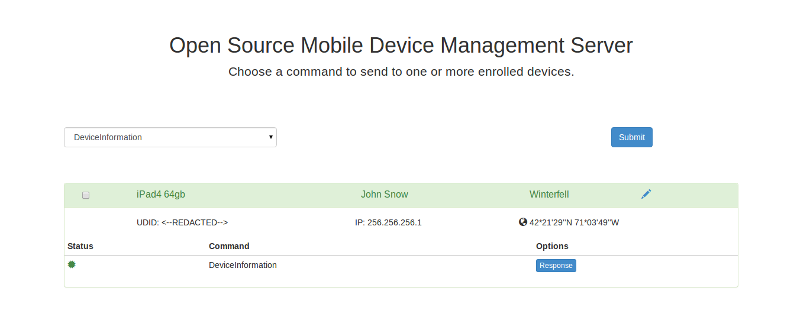

# Overview

Instructions and code for setting up a simple iOS Mobile Device Management (MDM) server.  MDM allows for OS level control of multiple devices from a centralized location.  A remote administrator can install/remove apps, install/revoke certificates, lock the device, change password requirements, etc.  

# Prerequisites

 * Publicly accessible Linux/Unix server
 * Apple Enterprise Account
 * Apple Developer Account
 * Python 2.7
 * openssl command-line
 * Java SDK (java/javac)
 * Apple's iPhone Configuration Utility
    * [OS X Version](http://support.apple.com/kb/dl1465)
    * [Windows Version](http://support.apple.com/kb/DL1466)

# Certificate Setup

### Instructions

 1. Run **make_certs.sh**, which can be found in the **/scripts** directory.
   * Carefully read the directions given for each step and follow the instructions
   * This should generate several certificates needed to move forward to the next step.  See the Explanation section for more details.
 2. Go to Apple's [iOS Provisioning Portal](Apple Member Center). Upload **customer.csr** in the **/scripts** folder on the iOS Provisioning Portal.
   * You will be given the option to download a .cer file.  Do so and name this file something along the lines of YOUR_MDM.cer.  
   * Run the following openssl command in your terminal and then move the generated mdm.pem file to **/vendor-signing/com/softhinker** (it should replace an empty file of the same name).
     * <code>openssl x509 -inform der -in YOUR_MDM.cer -out mdm.pem</code>
 3. Find **Test.java** in the **/vendor-signing/com/softhinker** folder.  On line 95, replace the word *test* with the PEM password that you used when running make_certs.sh.
   * Replace only the word test so that your password is still in quotes.
 4. Run the **vendor-signing.sh** script found in the **/scripts** directory.
   * There now should be a file named plist_encoded located in **/vendor-signing**.
 5. Go to [Apple's Push Certificates Portal](https://identity.apple.com/pushcert/) and upload the plist_encoded file.  Download the certificate as **PushCert.pem** and place it within the **/server** directory.
   * Notice the (i) icon beside the renew option.  If you click it there will be a long string of text ending in **UID=com.apple.mgmt...**, make sure to copy that string starting at **com** since you will need it later on in the enrollment process.

### Explanation

In the scripts directory, there exists a server.cnf.  This is used for certificate generation and the first step of the script will place the server IP address in the correct place.

In the vendor-signing directory, under com/softhinker, you will notice several certificates are included:
 * customer.der
   * Must be replaced
   * Generated from **make_certs.sh**
   * Accept defaults for all other values (Including **Challenge password**)
 * intermediate.pem 
   * Automatically replace by **make_certs.sh**
   * Apple's WWDR intermediate certificate
 * mdm.pem
   * Must be replaced
   * Obtain from [iOS Provisioning Portal](Apple Member Center). You need to have a developer account with Apple beforehand. Once you do you can locate the area here: https://developer.apple.com/account/ios/profile/profileList.action
   * Use **customer.csr** created by **make_certs.sh**
   * Download the file, should be in .cer format
   * Convert to pem: **openssl x509 -inform der -in YOUR_MDM.cer -out mdm.pem**
 * root.pem
   * Automatically replace by **make_certs.sh**
   * Apple's root certificate
 * vendor.p12
   * Must be replaced
   * Generated from **make_certs.sh**

After generating certificates and placing your PEM password in line 95 of Test.java, the vendor-signing.sh script will be run.  This script takes several scripts we have already generated and creates a plist for use with apple's push certificates portal.

# Enrollment profile

Open the **iPhone Configuration Utilities** program.  Select **Configuration Profiles**, click the **New** button, and fill out the sections as follows:
 * General
   *  Name: A unique name for you to keep track of
   *  Identifier: **com.apple.mgmt...** string you recorded during certificate generation (see step 5 of the certificate setup instructions)
 * Certificates
   * Use **vendor.p12** generated during certificate creation (should be in the /vendor-signing/com/softhinker/ directory)
   * Password: Enter the PEM password you used during certificate creation
 * Mobile Device Management
   * Server URL: https://YOUR_HOSTNAME:8080/server
   * Check In URL: https://YOUR_HOSTNAME:8080/checkin
   * Topic: **com.apple.mgmt...** string (same as General->Identifier)
   * Identity: vendor.p12
   * Sign messages: Checked
   * Check out when removed: Unchecked
   * Query device for: Check all that you want
   * Add / Remove: Check all that you want
   * Security: Check all that you want
   * Use Development APNS server: Uncheck

Your screen should be similar to the following:

After you are finished, highlight the entry in the table, and click **Export**.  Choose **None** for security and then **Export...**.  The export window should look like:  

Save in the **mdm-server/server/** directory as **Enroll**.  You should now have an **Enroll.mobileconfig** file.

Finally, some versions of IPCU don't include the correct settings for all versions of iOS.  Open the Enroll.mobileconfig file in a text editor.  Find the **AccessRights** key.  Make sure the value is 8191 (some versions of ICPU will use 2047, if you see this, change it to 8191) and then save.

# Server Setup

The server code is based on and heavily takes from [Intrepidus Group's blackhat presentation](https://intrepidusgroup.com/).  Copy over the **mdm-server/server** directory you put the enrollment profile and certificates in to your server.

You must have the following installed on the server:
  * Openssl
    * Recommend downloading and compiling yourself
    * Some Debian-based distros disable features needed by M2Crypto
    * Source available at [http://www.openssl.org/source/](http://www.openssl.org/source/)
  * Python 2.7, with the following libraries
     * [web.py](http://webpy.org/)
     * [M2Crypto](http://chandlerproject.org/bin/view/Projects/MeTooCrypto)
     * [PyOpenSSL](https://pypi.python.org/pypi/pyOpenSSL)

Network Settings
  * Outbound access to gateway.push.apple.com:2195
  * Inbound access to port 8080
  * iOS device must also have outbound access to gateway.push.apple.com:5223

If everything is setup appropriately, simply navigate to the **/server** directory and run <code>python server.py</code>.

On the device navigate to: **https://YOUR_HOST:8080/**
Once there you need to, in order: 
 1. Tap *here* to install the CA Cert (for Server/Identity)
 2. Tap *here* to enroll in MDM (the device should appear after this step) 
 3. Select Command (DeviceLock is a good one to test) and check your device.  Click Submit to send the command.
 4. If everything works, the device should lock and you're good to go!  As of right now some of the commands aren't fully implemented.  Feel free to experiment with different commands!

---

---

You can now run those commands from any web browser, a successfull command will often looks something like the following:

---

---

Click the "Response" button to see the plist response from apple.  Click the pencil to edit the device name, device owner, and device location.

When stopping the server, the standard control-c doesn't usually work.  Instead use control-z to suspend the process and then use a kill command to end the process.

    ^z
    [1]+  Stopped                 python server.py
    user:~/mdm-server/server$ kill %1
    [1]+  Terminated              python server.py
    user:~/mdm-server/server$ 

The server uses the pickle library to save devices.  When the device class is updated, the pickle format may be invalidated, causing the server to error.  In order to fix this, remove the devicelist.pickle file (make a backup just in case!) and re-enroll all devices.

# Client Reporting

The MDM server also has REST endpoints for reporting issues and geolocation data from the enrolled clients.  This functionality may be used at a later point in time by a security app. The API can be imported into any project as follows:

* Click on the top level Project item and add files ("option-command-a")
* Navigate to client-reporting/
* Highlight the client-reporting subdirectory
* Click the Add button

The library provides the following functions:

    +(void) setHostAddress: (NSString*) host; // Set where the MDM server lives
    +(void) setPause : (BOOL) toggle; // Toggle whether to add a thread execution pause to allow requests to finish
    +(void) reportJailbreak;  // Report that the device has been jailbroken
    +(void) reportDebugger; // Report that the application has a debugger attached
    +(void) reportLocation : (CLLocationCoordinate2D*) coords; // Report the lat/lon location of the device
    
"setHostAddress" and "setPause" are meant to be set once only, and effect all "report" calls.  An example usage may look like:

    // Code in application init
    [client_reporting setHostAddress:@"192.168.0.0"];
    [client_reporting setPause:YES];
    
    // Later code during execution
    [client_reporting reportDebugger]

This client API can be coupled with the [iMAS security-check controls](git@github.com:project-imas/security-check.git) to provide accurate reporting of jailbreak and debugger detection.  

Apologies for the long and complex setup, we hope to eventually make things easier and simpler.  Please post questions to github if you get stuck and we'll do our best to help.  Enjoy!

# LICENSE AND ATTRIBUTION

Copyright 2013-2014 The MITRE Corporation, All Rights Reserved.

Licensed under the Apache License, Version 2.0 (the "License"); you may not use this work except in compliance with the License. You may obtain a copy of the License at

    http://www.apache.org/licenses/LICENSE-2.0

Unless required by applicable law or agreed to in writing, software distributed under the License is distributed on an "AS IS" BASIS, WITHOUT WARRANTIES OR CONDITIONS OF ANY KIND, either express or implied. See the License for the specific language governing permissions and limitations under the License.

This project also uses code from various sources under various licenses.

[The original code from the Intrepidus Group's python server is under the BSD License found here.](server/LICENSE)

[The Softhinker certificate signing code is under the Apache License found here.](vendor-signing/LICENSE)

[The website's Bootstrap code is under the MIT License found here.](server/static/dist/LICENSE)

Finally we use some free [glyphicons](http://glyphicons.com/) that are included with bootstrap.
